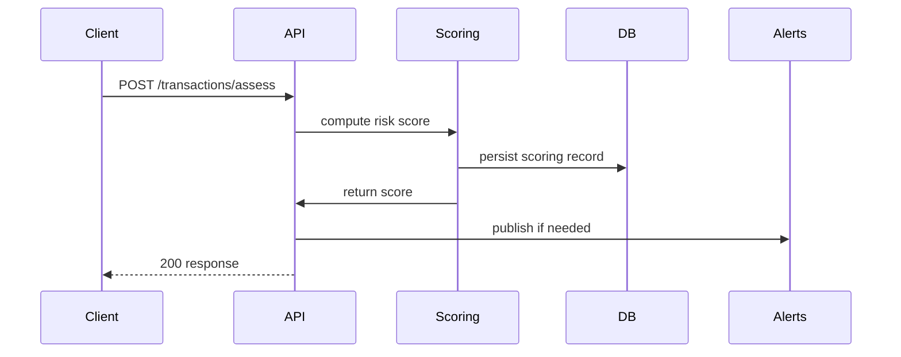

# Payment Fraud Detection System Design

## Technology choice
- **Framework:** FastAPI provides a production-ready asynchronous API, rapid iteration, and easy Pydantic validation for data contracts and is well-suited for integrating ML scoring pipelines and background tasks.
- **Language:** Python allows direct reuse of data science libraries (scikit-learn, pandas) and ML onboarding for fraud detection scoring.
- **Justification:** This stack balances API performance, developer velocity, and analytics compatibility for fraud scoring while aligning with grounded standards [S2].

## Component breakdown
1. **API Gateway (`src/app/api.py`):** Validates incoming transactions, orchestrates fraud scoring requests, handles responses, and logs request context.
2. **Transaction Ingestor (`src/app/ingestion.py`):** Normalizes incoming records, applies feature engineering, and persists raw input for audit trails.
3. **Scoring Engine (`src/app/scoring.py`):** Loads ML models (e.g., gradient-boosted trees serialized via joblib), calculates risk score, and triggers rule engines.
4. **Rule Evaluator (`src/app/rules.py`):** Applies deterministic business rules (velocity checks, blacklists) after scoring to adjust outcomes.
5. **Persistence (`src/app/db.py`):** Interfaces with PostgreSQL via SQLAlchemy for transactions and alerts, enforces schema, and adds audit metadata.
6. **Alert Publisher (`src/app/alerts.py`):** Emits events to message bus (Kafka) or webhook for manual review, respecting downstream contract.
7. **Security/Config (`src/app/config.py`):** Loads secrets from environment variables or secret store and exposes typed configs for other modules, ensuring no secrets are hardcoded [S3].
8. **Monitoring (`src/app/telemetry.py`):** Records latency and scoring metrics for observability, aligning with security checklist requirements for detection [S1].

## API contract
### `POST /transactions/assess`
- **Request:** JSON with fields `transaction_id`, `amount`, `currency`, `account_id`, `timestamp`, `merchant`, `geo`, `device_info`
- **Response:** `200 OK` with `{ "transaction_id": "...", "risk_score": float (0-1), "status": "approved|manual_review|rejected", "reason_codes": [] }`
- **Errors:** `400` for validation errors, `503` if scoring backend unavailable.

### `GET /transactions/{transaction_id}`
- **Response:** Stored transaction record with score, status, and audit trails.

### `POST /alerts/manual_review`
- **Request:** `{ "transaction_id": "...", "reason": "..." }`
- **Response:** `204 No Content` after queuing manual review request.

Contract enforces strict validation via Pydantic to avoid malformed data and ensures idempotency via transaction IDs, meeting verification standards in [S1].

## Sequence diagram


## Security considerations
- **Secrets:** Credentials for DB and messaging are injected from environment/secret manager only; no hardcoded secrets [S3].
- **Audit & Logging:** All actions log request metadata, scoring decisions, and alert triggers to satisfy [S1].
- **Definition of Done:** Implementation must include code, tests, docs, and passed relevant security checklist items [S4] before closure.

## Project structure
```
design.md
pyproject.toml
.env.example
src/
├── main.py
├── app/
│   ├── __init__.py
│   ├── api.py
│   ├── config.py
│   ├── ingestion.py
│   ├── scoring.py
│   ├── rules.py
│   ├── db.py
│   ├── alerts.py
│   ├── telemetry.py
│   └── models/
│       ├── __init__.py
│       ├── transaction.py
│       ├── score.py
│       └── alert.py
tests/
├── __init__.py
├── test_api.py
├── test_scoring.py
└── test_rules.py
```
- **Entry point:** `src/main.py` starts FastAPI app, loads config, registers routers, and exposes `/docs` for OpenAPI.
- **Dependencies:** Declared in `pyproject.toml` (FastAPI, Uvicorn, SQLAlchemy, pydantic, joblib).
- **Tests:** Focused on API validation, scoring logic, and rule evaluation.
- **.env.example:** Documents needed env vars (DB_URL, MODEL_PATH, SECRET_KEY).

This comprehensive design aligns with the grounded standards and provides the developer with a full implementation blueprint.